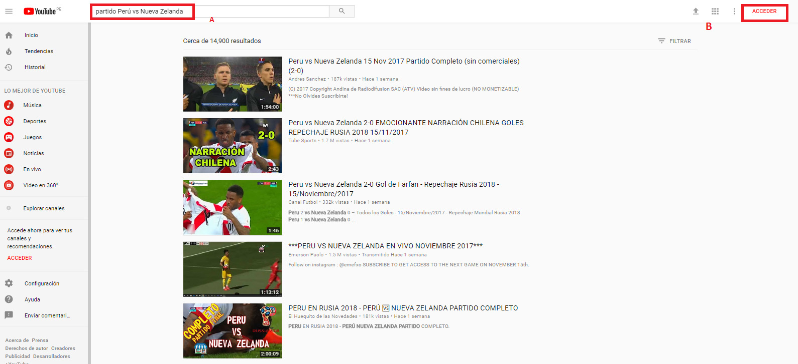
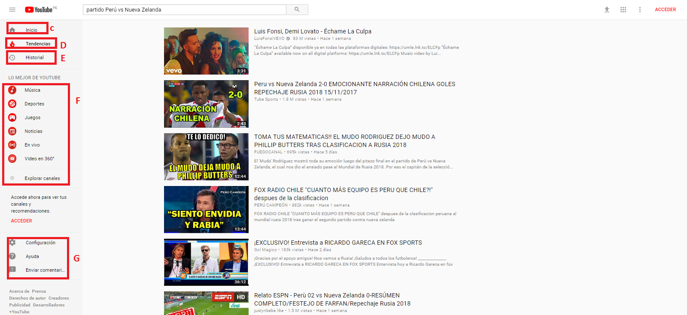
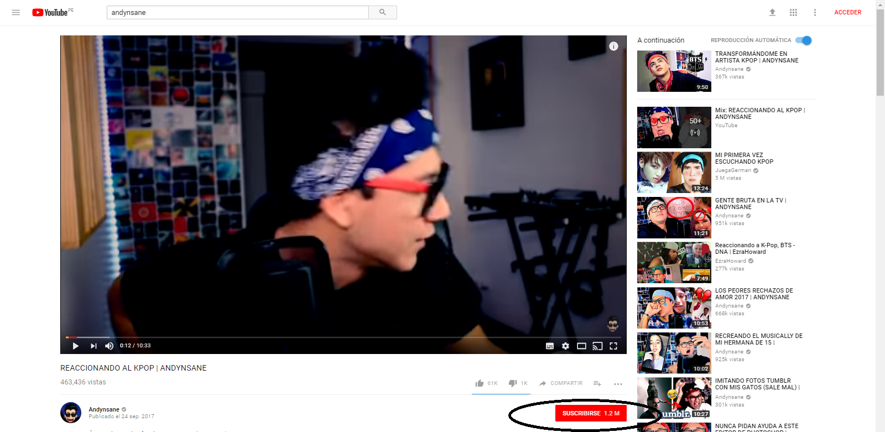
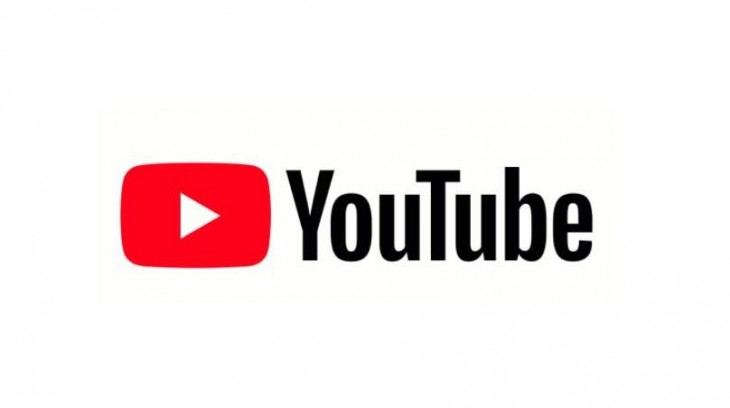
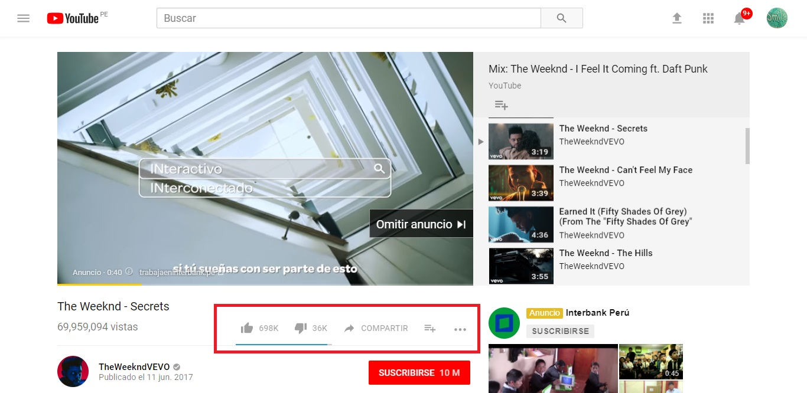
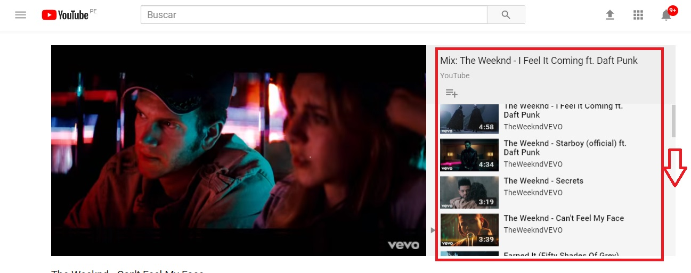

### Proyecto: "Youtube" ###

--------------------------------------------------------------

1) __OBJETIVO__

  Para este proyecto nos indican que debemos explicar qué partes conforman el UX y qué partes el UI,del canal de Youtube, que es la siguiente web:

  

2) __DESARROLLO__

  2.1 __UX__

  2.1.1 *Primera sección*

   A) Nos permite ingresar en un buscador un video con la información ingresada.

   B) Nos permite acceder con nuestra cuenta de gmail.

    Estas partes están detalladas en la siguiente imagen:

  

  2.1.2 *Segunda Sección*

   c) Botón de inicio: que nos permite volver a la parte inicial de youtube si estamos en un video,para evitar retroceder página por página.

    D) Tendencias: donde podemos verificar los videos mas vistos.

    E) Historial: Nos ofrece un historial que nos permite ubicar un video que tal vez en el caso de que hayamos olvidado en nuestra exploración con que nombre lo ubicamos poder encontrarlo en esta opción.

    F) Esta sección está formada por lo mejor de youtube parte en la que se encuentra todo lo  que uno busca en youtube pero de forma específica ya sea música,deportes,juegos,noticias,videos en vivo y videos en 360 grados uno de las que particularmente he utilizado es la de videos en vivo ya que así puedo ver una novela o serie que tranmiten en canales internacionales que no se muestra en la televisión peruana(ya que hay algunas que si) y no perderme de ello.

    G) Por último youtube también nos ofrece una opción de configuración en la que podemos cambiar de cuenta,borrar historial y modificar la opción de sugerencias de videos dependiendo de lo que uno ve(yo por ejemplo tengo esa opción activada).

  

  2.1.3 *Tercera Sección*

   Subscrición: Esta parte ya se encuentra cuando ingresamos a un video por ejemplo en esta imagen ingreso a un video de un youtuber peruano :Andysane en la cual al pinchar esa opción ya me encuentro subcrito y cada vez que él publique un video nuevo youtube me notifica.

  

  2.2 __UI__  

  2.2.1 En el diseño del logo de youtube,  se utilizan los colores rojo,negro y blanco, mas detalle en la siguiente imagen:

  

  2.2.2 cuenta con botones que permiten poner subtitulos,configuar el video o cambiar a tamaño de modo completo.

  2.2.3 botones que te permiten compartir el video en redes sociales, pana poner me gusta o no al video.

  2.2.4 las estructura en general muestra un listado  de videos de forma vertical de modo que es de fácil acceso para  el usuario elegir el siguiente video a ver a su alcance sin necesidad de volver a la parte de inicio o retroceder.

